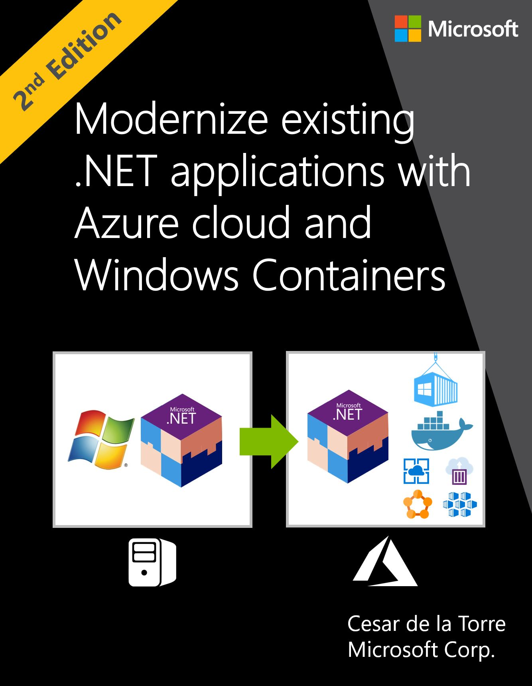
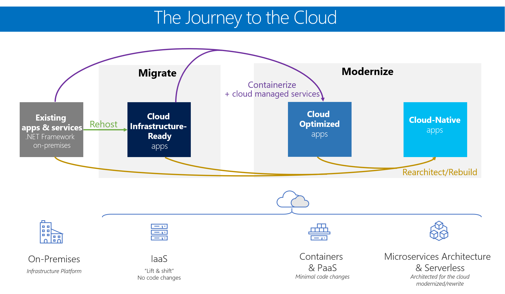
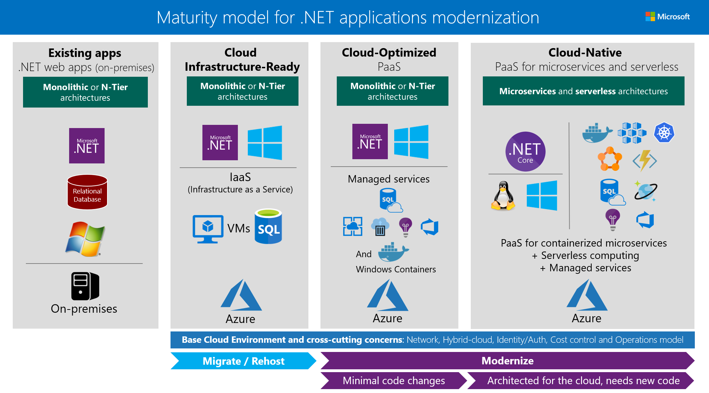
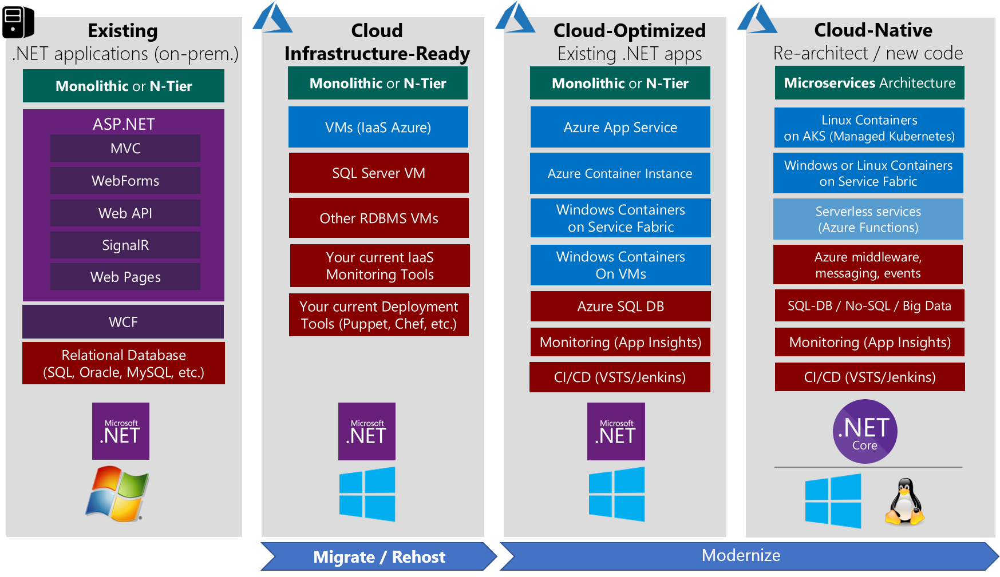
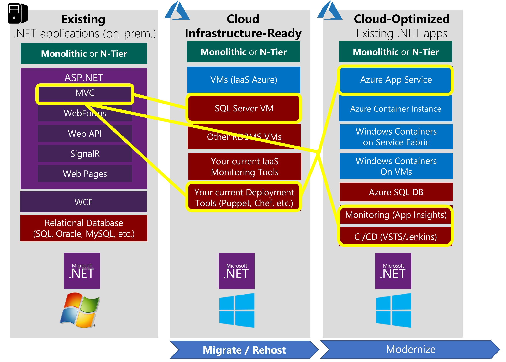
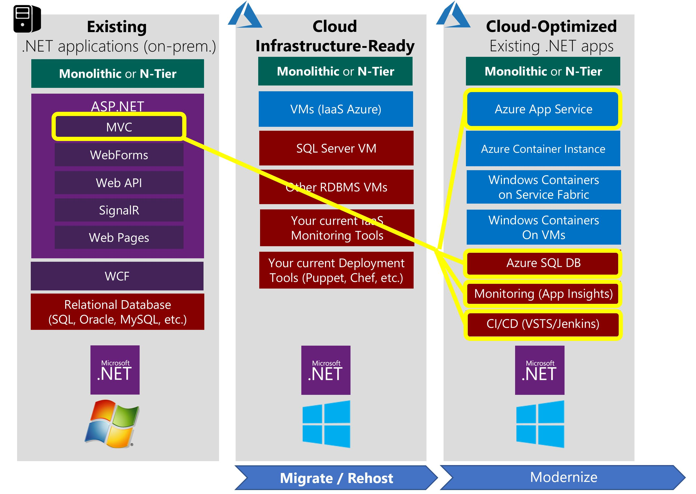
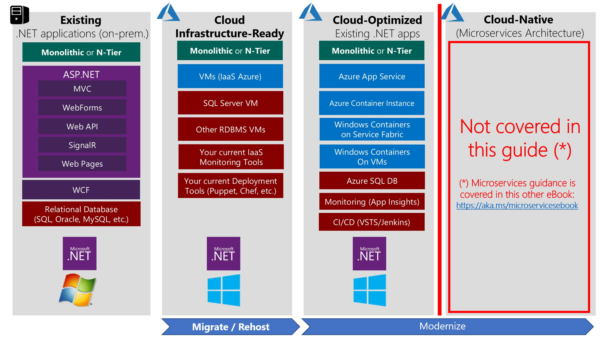

# Modernize existing .NET applications with Azure cloud and Windows Containers (2nd edition)

PUBLISHED BY  
Microsoft Press and Microsoft DevDiv  
Divisions of Microsoft Corporation  
One Microsoft Way  
Redmond, Washington 98052-6399  

Copyright © 2018 by Microsoft Corporation  

All rights reserved. No part of the contents of this book may be reproduced in any form or by any means without the written permission of the publisher.

This book is available for free in the form of an electronic book (e-book) available through multiple channels at Microsoft such as <http://dot.net/architecture>.

If you have questions related to this book, email at [dotnet-architecture-ebooks-feedback@service.microsoft.com](mailto:dotnet-architecture-ebooks-feedback@service.microsoft.com?subject=Feedback%20for%20.NET%20Container%20&%20Microservices%20Architecture%20book)

This book is provided "as-is" and expresses the author's views and opinions. The views, opinions, and information expressed in this book, including URL and other Internet website references, may change without notice.

Some examples depicted herein are provided for illustration only and are fictitious. No real association or connection is intended or should be inferred.

Microsoft and the trademarks listed at <https://www.microsoft.com> on the "Trademarks" webpage are trademarks of the Microsoft group of companies. All other marks are property of their respective owners.

Author:
> **Cesar de la Torre**, Sr. PM, .NET Product Team, Microsoft Corp.

Participants and reviewers:
> **Scott Hunter**, Partner Director PM, .NET team, Microsoft  
> **Paul Yuknewicz**, Principal PM Manager, Visual Studio Tools team, Microsoft  
> **Lisa Guthrie**, Sr. PM, Visual Studio Tools team, Microsoft  
> **Ankit Asthana**, Principal PM Manager, .NET team, Microsoft  
> **Unai Zorrilla**, Developer Lead, Plain Concepts  
> **Javier Valero**, Chief Operating Officer at Grupo Solutio  

## Introduction

When you decide to modernize your web applications or services and move them to the cloud, you don't necessarily have to fully rearchitect your apps. Rearchitecting an application by using an advanced approach like microservices isn't always an option because of cost and time restraints. Depending on the type of application, rearchitecting an app also might not be necessary. To optimize the cost-effectiveness of your organization's cloud migration strategy, it's important to consider the needs of your business and requirements of your apps. You'll need to determine:

- Which apps require a transformation or rearchitecting.

- Which apps need to be only partially modernized.

- Which apps you can "lift and shift" directly to the cloud.

## About this guide

This guide focuses primarily on initial modernization of existing Microsoft .NET Framework web or service-oriented applications, meaning the action of moving a workload to a newer or more modern environment without significantly altering the application's code and basic architecture. 

This guide also highlights the benefits of moving your apps to the cloud and partially modernizing apps by using a specific set of new technologies and approaches, like Windows Containers and related compute-platforms in Azure supporting Windows Containers.

## Path to the cloud for existing .NET applications

Organizations typically choose to move to the cloud for the agility and speed they can get for their applications. You can set up thousands of servers (VMs) in the cloud in minutes, compared to the weeks it typically takes to set up on-premises servers.

There isn't a single, one-size-fits-all strategy for migrating applications to the cloud. The right migration strategy for you will depend on your organization's needs and priorities, and the kind of applications you are migrating. Not all applications warrant the investment of moving to a platform as a service ([PaaS](https://azure.microsoft.com/overview/what-is-paas/)) model or developing a [cloud-native](https://www.gartner.com/doc/3181919/architect-design-cloudnative-applications) application model. In many cases, you can take a phased or incremental approach to invest in moving your assets to the cloud, based on your business needs.

For modern applications with the best long-term agility and value for the organization, you might benefit from investing in *cloud-native* application architectures. However, for applications that are existing or legacy assets, the key is to spend minimal time and money (no rearchitecting or code changes) while moving them to the cloud, to realize significant benefits.

Figure 1-1 shows the possible paths you can take when you move existing .NET applications to the cloud in incremental phases.

 

> **Figure 1-1**. Modernization paths for existing .NET applications and services

Each migration approach has different benefits and reasons for using it. You can choose a single approach when you migrate apps to the cloud, or choose certain components from multiple approaches. Individual applications aren't limited to a single approach or maturity state. For instance, a common hybrid approach would have certain on-premises components plus other components in the cloud.

The definition and short explanation for each application maturity level are the following:

**Level 1: Cloud Infrastructure-Ready** applications: In this migration approach, you simply migrate or rehost your current on-premises applications to an infrastructure as a service ([IaaS](https://azure.microsoft.com/overview/what-is-iaas/)) platform. Your apps have almost the same composition as before, but now you deploy them to VMs in the cloud.
This simple type of migration is typically known in the industry as "Lift & Shift."

**Level 2: Cloud Optimized** applications: At this level and still without rearchitecting or altering significant code, you can gain additional benefits from running your app in the cloud with modern technologies like containers and additional cloud-managed services. You improve the agility of your applications to ship faster by refining your enterprise development operations (DevOps) processes. You achieve this by using technologies like Windows Containers, which is based on Docker Engine. Containers remove the friction that’s caused by application dependencies when you deploy in multiple stages. In this maturity model, you can deploy containers on IaaS or PaaS while using additional cloud-managed services related to databases, cache as a service, monitoring, and continuous integration/continuous deployment (CI/CD) pipelines.

The third level of maturity is the ultimate goal in the cloud, but it's optional for many apps and not the main focus of this guide:

**Level 3: Cloud-Native** applications: This migration approach typically is driven by business need and targets modernizing your mission-critical applications. At this level, you use PaaS services to move your apps to PaaS computing platforms. You implement [cloud-native](https://www.gartner.com/doc/3181919/architect-design-cloudnative-applications) applications and microservices architecture to evolve applications with long-term agility, and to scale to new limits. This type of modernization usually requires architecting specifically for the cloud. New code often must be written, especially when you move to cloud-native application and microservice-based models. This approach can help you gain benefits that are difficult to achieve in your monolithic and on-premises application environment.

Table 1-1 describes the main benefits of and reasons for choosing each migration or modernization approach.

| **Cloud Infrastructure-Ready**   *Lift and shift* | **Cloud-Optimized**   *Modernize* | **Cloud-Native**   *Modernize, rearchitect and rewrite* |
|---|---|---|
| **Application's compute target** |
| Applications deployed to VMs in Azure | Monolithic or N-Tier apps deployed to Azure App Service, Azure Container Instance (ACI), VMs with containers, Azure Service Fabric, or AKS (Azure Kubernetes Service) | Containerized microservices on Azure Kubernetes Service (AKS), Service Fabric and/or serverless microservices based on Azure Functions. |
| **Data target** |
| SQL or any relational database on a VM | Azure SQL Database Managed Instance or another managed database in the cloud. | Fined-grain databases per microservice, based on Azure SQL Database, Azure Cosmos DB, or another managed database in the cloud |
| **Advantages**|
| <li>No rearchitecting, no new code <li> Least effort for quick migration <li> Least-common denominator supported in Azure <li> Basic availability guarantees <li> After moving to the cloud, it's easier to modernize even more | <li> No rearchitecting <li> Minimal code/config changes <li> Improved deployment and DevOps agility to release because of containers <li> Increased density and lower deployment costs <li> Portability of apps and dependencies <li> Flexibility of host targets: PaaS approaches or IaaS | <li> Architect for the cloud, you get the best benefits from the cloud but new code is needed <li> Microservices cloud-native approaches <li> Modern mission-critical applications, cloud-resilient hyper-scalable <li> Fully managed services <li> Optimized for scale <li> Optimized for autonomous agility by subsystem <li> Built on deployment and DevOps |
| **Challenges** |
| <li> Smaller cloud value, other than shift in operating expense or closing datacenters <li> Little is managed: No OS or middleware patching; might use infrastructure solutions, like Terraform, Spinnaker, or Puppet | <li> Containerizing is an additional step in the learning curve for developers and IT Operations <li> DevOps and CI/CD pipelines is usually ‘a must’ for this approach. If not currently present in the culture of the organization, it might be an additional challenge| <li> Requires rearchitecture for cloud native apps and microservice architectures and usually requires significant code refactoring or rewriting when modernizing (increased time and budget) <li> DevOps and CI/CD pipelines is usually ‘a must’ for this approach. If not currently present in the culture of the organization, it might be an additional challenge|
> **Table 1-1.** Benefits and challenges of modernization paths for existing .NET applications and services

### Key technologies and architectures by maturity level

.NET Framework applications initially started with the .NET Framework version 1.0, which was released in late 2001. Then, companies moved towards newer versions (such as 2.0, 3.5 and .NET 4.x). Most of those applications ran on Windows Server and Internet Information Server (IIS), and used a relational database, like SQL Server, Oracle, MySQL, or any other RDBMS.

Most existing .NET applications might nowadays be based on .NET Framework 4.x, or even on .NET Framework 3.5, and use web frameworks like ASP.NET MVC, ASP.NET Web Forms, ASP.NET Web API, Windows Communication Foundation (WCF), ASP.NET SignalR, and ASP.NET Web Pages. These established .NET Framework technologies depend on Windows. That dependency is important to consider if you are simply migrating legacy apps and you want to make minimal changes to your application infrastructure.

Figure 1-2 shows the primary technologies and architecture styles used at each of the three cloud maturity levels:

> **Figure 1-2.** Primary technologies for each maturity level for modernizing existing .NET web applications

Figure 1-2 highlights the most common scenarios, but many hybrid and mixed variations are possible when it comes to architecture. For example, the maturity models apply not only to monolithic architectures in existing web apps, but also to service orientation, N-Tier, and other architecture style variations. The higher focus or percentage on one or another architecture type and related technologies determines the overall maturity level of your applications.

Each maturity level in the modernization process is associated with the following key technologies and approaches:

- **Cloud Infrastructure-Ready** (rehost or basic lift & shift): As a first step, many organizations want only to quickly execute a cloud-migration strategy. In this case, applications are rehosted. Most rehosting can be automated by using [Azure Migrate](https://aka.ms/azuremigrate), a service that provides the guidance, insights, and mechanisms needed to assist you in migrating to Azure based on cloud tools like [Azure Site Recovery](https://azure.microsoft.com/services/site-recovery/) and [Azure Database Migration Service](https://azure.microsoft.com/campaigns/database-migration/). You can also set up rehosting manually, so that you can learn infrastructure details about your assets when you move legacy apps to the cloud. For example, you can move your applications to VMs in Azure with little modification-probably with only minor configuration changes. The networking in this case is similar to an on-premises environment, especially if you create virtual networks in Azure.

- **Cloud-Optimized** (Managed Services and Windows Containers): This model is about making a few important deployment optimizations to gain some significant benefits from the cloud, without changing the core architecture of the application. The fundamental step here is to add [Windows Containers](https://docs.microsoft.com/virtualization/windowscontainers/about/) support to your existing .NET Framework applications. This important step (containerization) doesn't require touching the code, so the overall lift and shift effort is light. You can use tools like [Image2Docker](https://github.com/docker/communitytools-image2docker-win) or Visual Studio, with its tools for [Docker](https://www.docker.com/). Visual Studio automatically chooses smart defaults for ASP.NET applications and Windows Containers images. These tools offer both a rapid inner loop, and a fast path to get the containers to Azure. Your agility is improved when you deploy to multiple environments. 
Then, moving to production, you can deploy your Windows Containers to [Azure Web App for Containers](https://azure.microsoft.com/services/app-service/containers/), [Azure Container Instances (ACI), and Azure VMs with Windows Server 2016 and containers if you prefer an IaaS approach. For slightly more complex multi-container applications, into orchestrators like [Azure Service Fabric](https://azure.microsoft.com/services/service-fabric/) or [Azure Kubernetes Service (AKS/ACS)](https://azure.microsoft.com/services/container-service/). 
During this initial modernization, you can also add assets from the cloud, such as monitoring with tools like [Azure Application Insights](https://docs.microsoft.com/azure/application-insights/app-insights-overview); CI/CD pipelines for your app lifecycles with [Azure DevOps Services](https://visualstudio.microsoft.com/team-services/); and many more data resource services that are available in Azure. For instance, you can modify a monolithic web app that was originally developed by using traditional [ASP.NET Web Forms](https://www.asp.net/web-forms) or [ASP.NET MVC](https://www.asp.net/mvc), but now you deploy it by using Windows Containers. When you use Windows Containers, you should also migrate your data to a database in [Azure SQL Database Managed Instance](https://docs.microsoft.com/azure/sql-database/), all without changing the core architecture of your application.

- **Cloud-Native**: As introduced, you should think about architecting [cloud-native](https://www.gartner.com/doc/3181919/architect-design-cloudnative-applications) applications when you are targeting large and complex applications with multiple independent development teams working on different microservices that can be developed and deployed autonomously. Also, due to granularized and independent scalability per microservice. These architectural approaches face very important challenges and complexities but can be greatly simplified by using cloud PaaS and orchestrators like [Azure Kubernetes Service (AKS/ACS)](https://azure.microsoft.com/services/container-service/) (managed Kubernetes), [Azure Service Fabric, and [Azure Functions](https://azure.microsoft.com/services/functions/) for a serverless approach. All these approaches (like microservices and Serverless) typically require you to architect for the cloud and write new code—code that is adapted to specific PaaS platforms, or code that aligns with specific architectures, like microservices.

Figure 1-3 shows the internal technologies that you can use for each maturity level:

> **Figure 1-3.** Internal technologies for each modernization maturity level

## Lift and shift scenario

For lift and shift migrations, keep in mind that you can use many different variations of lift and shift in your application scenarios. If you only rehost your application, you might have a scenario like the one shown in Figure 1-4, where you use VMs in the cloud only for your application and for your database server.

> **Figure 1-4**. Example of a pure IaaS scenario in the cloud

## Modernization scenarios

For modernization scenarios, you might have a pure Cloud-Optimized application that uses elements only from that maturity level. Or, you might have an intermediate-state application with some elements from Cloud Infrastructure-Ready and other elements from Cloud-Optimized (a "pick and choose" or mixed model), like in Figure 1-5.

> **Figure 1-5.** Example "pick and choose" scenario, with database on IaaS, DevOps, and containerization assets

Next, as the ideal scenario for many existing .NET Framework applications to migrate, you could migrate to a Cloud-Optimized application, to get significant benefits from little work. This approach also sets you up for Cloud-Native as a possible future evolution. Figure 1-6 shows an example.

> **Figure 1-6.** Example Cloud-Optimized apps scenario, with Windows Containers and managed services

Going even further, you could extend your existing Cloud-Optimized application by adding a few microservices for specific scenarios. This would move you partially to the level of Cloud-Native model, which is not the main focus of the present guidance.

## What this guide does not cover

This guide covers a specific subset of the example scenarios, as shown in Figure 1-7. This guide focuses only on lift and shift scenarios, and ultimately, on the Cloud-Optimized model. In the Cloud-Optimized model, a .NET Framework application is modernized by using Windows Containers, plus additional components like monitoring and CI/CD pipelines. Each component is fundamental to deploying applications to the cloud, faster, and with agility.

> **Figure 1-7.** Cloud-Native is not covered in this guide

The focus of this guide is specific. It shows you the path you can take to achieve a lift and shift of your existing .NET applications, without rearchitecting, and with no code changes. Ultimately, it shows you how to make your application Cloud-Optimized.

This guide doesn't show you how to create Cloud-Native applications, such as how to evolve to a microservices architecture. To rearchitect your applications or to create brand-new applications that are based on microservices, see the e-book [.NET Microservices: Architecture for containerized .NET applications](https://aka.ms/microservicesebook).

### Additional resources

- **Containerized Docker application lifecycle with Microsoft platform and tools** (downloadable e-book): [*https://aka.ms/dockerlifecycleebook*](https://aka.ms/dockerlifecycleebook)

- **.NET Microservices: Architecture for containerized .NET applications** (downloadable e-book): [*https://aka.ms/microservicesebook*](https://aka.ms/microservicesebook)

- **Architecting modern web applications with ASP.NET Core and Azure** (downloadable e-book): [*https://aka.ms/webappebook*](https://aka.ms/webappebook)

## Who should use this guide

This guide was written for developers and solution architects who want to modernize existing ASP.NET web applications or WCF services that are based on the .NET Framework, for improved agility in shipping and releasing applications.

You also might find this guide useful if you are a technical decision maker, such as an enterprise architect or a development lead/director who just wants an overview of the benefits that you can get by using Windows Containers, and by deploying to the cloud when using Microsoft Azure.

## How to use this guide

This guide addresses the "why"-why you might want to modernize your existing applications, and the specific benefits you get from using Windows Containers when you move your apps to the cloud. The content in the first few chapters of the guide is designed for architects and technical decision makers who want an overview, but who don't need to focus on implementation and technical, step-by-step details.

The last chapter of this guide introduces multiple walkthroughs that focus on specific deployment scenarios. This guide offers shorter versions of the walkthroughs, to summarize the scenarios and highlight their benefits. The full walkthroughs drill down into setup and implementation details, and are published as a set of [wiki posts](https://github.com/dotnet-architecture/eShopModernizing/wiki) in the same public [GitHub repo](https://github.com/dotnet-architecture/eShopModernizing) where related sample apps reside (discussed in the next section). The last chapter and the step-by-step wiki walkthroughs on GitHub will be of more interest to developers and architects who want to focus on implementation details.

## Sample apps for modernizing legacy apps: eShopModernizing

The [eShopModernizing](https://github.com/dotnet-architecture/eShopModernizing) repo on GitHub offers two sample applications that simulate legacy monolithic web applications. One web app is developed by using ASP.NET MVC; the second web app is developed by using ASP.NET Web Forms and the third app is an N-Tier app with a WinForms client desktop app consuming a WCF service backend. All these apps are based on the traditional .NET Framework. These sample apps don't use .NET Core or ASP.NET Core as they are supposed to be existing/legacy .NET Framework applications to be modernized.

These sample apps have a second version, with modernized code, and which are fairly straightforward. The most important difference between the app versions is that the second versions use Windows Containers as the deployment choice. There also are a few additions to the second versions, like Azure Storage Blobs for managing images, Azure Active Directory for managing security, and Azure Application Insights for monitoring and auditing the applications.

## Send your feedback

This guide was written to help you understand your options for improving and modernizing existing .NET web applications. The guide and related sample applications are evolving. Your feedback is welcome! If you have comments about how this guide might be more helpful, please send them to [dotnet-architecture-ebooks-feedback@service.microsoft.com](mailto:dotnet-architecture-ebooks-feedback@service.microsoft.com?subject=Feedback%20for%20.NET%20Container%20&%20Microservices%20Architecture%20book).

>[!div class="step-by-step"]
[Next](lift-and-shift-existing-apps-azure-iaas.md)
